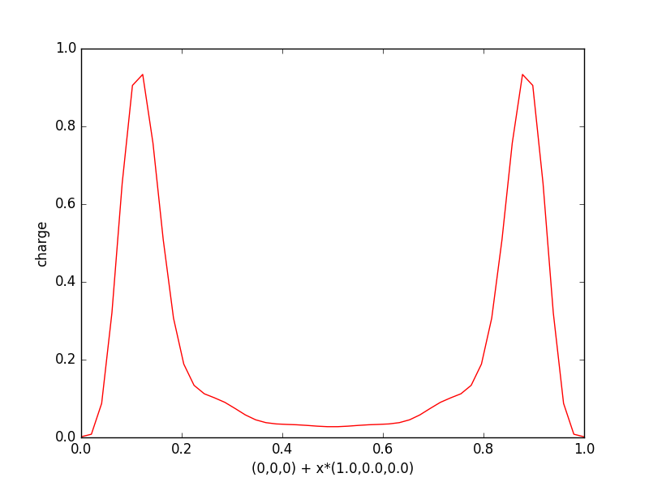
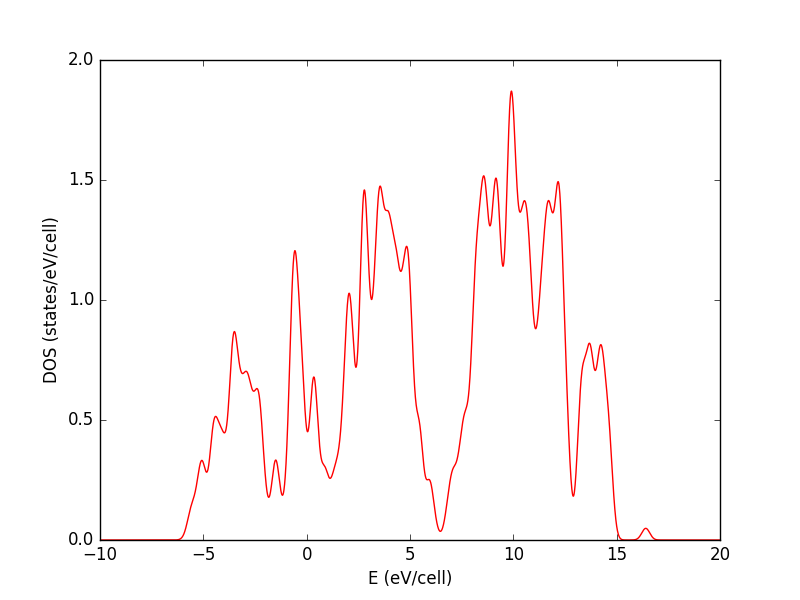
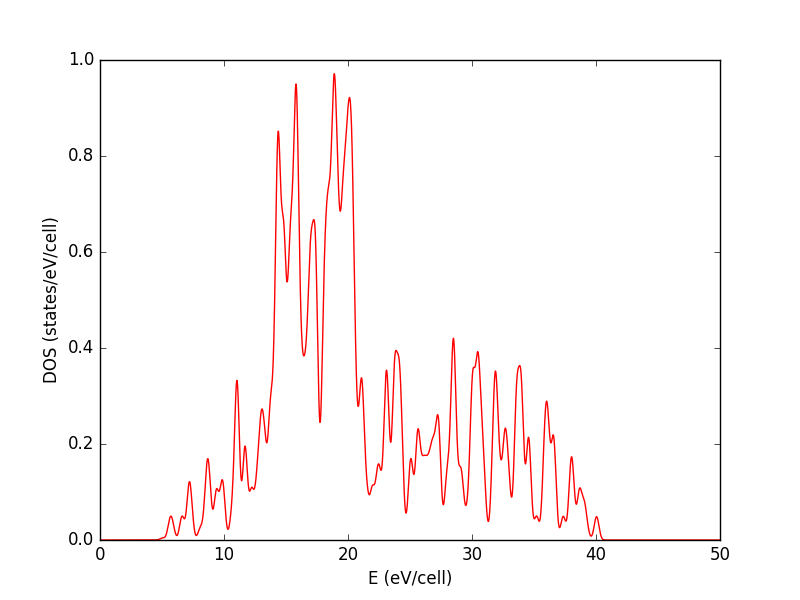

.. _tutorial:

*********
Tutorial
*********

This is a simple tutorial demonstrating the main functionalities of :py:mod:`postqe`. The examples below show how to use the package to perform the most common tasks. The code examples can be found in the directory *examples* of the package and can be run either as interactive sessions in your Python intepreter or as scripts.
The tutorial is based on the following examples:

+---------------+------------------------------------------------------------------------------------------------------------------------------------------+
| Example n.    | Description                                                                                                                              |
+===============+==========================================================================================================================================+
| 1             | Fitting :math:`E_{tot}(V)` for a cubic (isotropic) system using Murnaghan EOS                                                            |
+---------------+------------------------------------------------------------------------------------------------------------------------------------------+
| 2             | Calculate and plot the band structure of silicon                                                                                         |
+---------------+------------------------------------------------------------------------------------------------------------------------------------------+
| 3             | Calculate and plot the density of states (DOS) of silicon and nickel 						                           |
+---------------+------------------------------------------------------------------------------------------------------------------------------------------+
| 4             | Plotting a 1D section of the charge density                                                                                              |
+---------------+------------------------------------------------------------------------------------------------------------------------------------------+
| 5             | Plotting a 2D section of the charge density                                                                                              |
+---------------+------------------------------------------------------------------------------------------------------------------------------------------+
| 6             | Plotting 1D sections of different potentials                                                                                             |
+---------------+------------------------------------------------------------------------------------------------------------------------------------------+

Several simplified plotting functions are available in :py:mod:`postqe` and are used in the following tutorial to show what you can plot.
Note however that all plotting functions need the matplotlib library, which must be available on your system and can be used to further taylor your plot. 

===========================================================
Fitting the total energy using Murnaghan EOS (examples 1)
===========================================================

The simplest task you can do with :py:mod:`postqe` is to fit the total energy as a function of volume :math:`E_{tot}(V)` (example3). You can use
an equation of state (EOS) such as Murnaghan's or similar.  Currently the Murnaghan EOS and quadratic and quartic polynomials are implemented in :py:mod:`postqe`. 

Let's see how to fit :math:`E_{tot}(V)`. This is the case of isotropic cubic systems (simple cubic, body centered cubic, face centered cubic) or systems which can be approximated as isotropic (for example an hexagonal system with nearly constant :math:`c/a` ratio).

.. literalinclude:: ../examples/example1/example1.py
   :language: python
   :dedent: 4
   :lines: 10-
   
The :py:func:`fitEtotV` needs in input a file with two columns: the first with the volumes (in :math:`a.u.^3`), the second with energies (in :math:`Ryd/cell`). It returns the volumes *V* and energies *E* from the input file plus the fitting coefficients *a* and the :math:`\chi^2` *chi*. The fitting results are also written in details on the *stdout*:

.. literalinclude:: ../examples/example1/out

Optionally, you can plot the results with the :py:func:`plot_EV`. The original data are represented as points. If *a!=None*, a line with the fitting EOS will also be plotted. The output plot looks like the following:

===============================================================
Calculate and plot the band structure of silicon (examples 2)
===============================================================

TODO

==============================================================================================================================
Calculate and plot the density of states (DOS) of silicon and nickel (examples 3)
==============================================================================================================================

This example shows how to calculate the electronic density of states (DOS) with :py:mod:`postqe`. All necessary information is extracted from the standard xml output file. The following code shows how to do it for silicon (xml output file: Si.xml) 

.. literalinclude:: ../examples/example3/example3.py
   :language: python
   :dedent: 4
   :lines: 12-24
   
The :py:func:`compute_dos` needs in input the xml file produced by pw.x. You must also specify the range of energies (and step) for which the DOS will be calculate (*e_min*, *e_max*, *e_step*), plus the type of Gaussian broadening (*ngauss*) and the value (*degauss*). The DOS values (and corresponding energies) are returned by the function in *e, dos_up, dos_down*. If you want to write the DOS values on a file, you must give it in the parameter *filedos* and the file will be like:

.. literalinclude:: ../examples/example3/filedosSi
   :lines: 1-10

The first column contains the energy values, the second one contains the DOS values. Since silicon is non magnetic, the third column contains zero values. 
Optionally, you can plot the results with the :py:func:`simple_plot_xy`, which is simply a wrapper to matplotlib. The output plot looks like the following:

You can of course continue to calculate other quantities in your script. For example, the following lines show how to calculate the DOS for (magnetic) nickel. 

.. literalinclude:: ../examples/example3/example3.py
   :language: python
   :dedent: 4
   :lines: 25-

The above lines compute the electronic DOS for nickel with spin up and down and are rather selfexplaining. The last lines put together in a numpy matrix the dos for spin up and down to show it in the same plot using the *matplotlib* wrapper :py:func:`multiple_plot_xy`. 
The output plots look like the following:

.. image:: ../examples/example3/figure_Nidosupanddown.png
   :width: 500

===========================================================
Plotting a 1D section of the charge density  (examples 4)
===========================================================

A common task you can do with :py:mod:`postqe` is to plot the electronic charge density along one direction. The charge is read from the HDF5 
output file create by the Quantum Espresso calculation in *outdir*. Additional information are extracted from the standard xml output file.
The code to do this is shown below:

.. literalinclude:: ../examples/example4/example4.py
   :language: python
   :dedent: 4
   :lines: 10-
 
and it is essentially a call to the function :py:func:`plot_charge1D`, which needs in input the xml file create by Quantum Espresso. 
All other values are optional and taken either from the xml file or from default values. 
By default, the charge is plotted from the point (0,0,0) along the direction (1,0,0).

.. image:: ../examples/example4/figure_1.png
   :width: 500

===========================================================
Plotting a 2D section of the charge density  (examples 5)
===========================================================

This example is similar to the previous one except for producing a 2D plot of a planar section of the electronic charge density. The plane is defined 
by an initial point and two 3D vectors which define the plane. 

.. literalinclude:: ../examples/example5/example5.py
   :language: python
   :dedent: 4
   :lines: 10-
   
As in the previous example, it is essentially a call to a single function, which is in this case :py:func:`plot_charge1D`.
The output figure is:

.. image:: ../examples/example5/figure_1.png
   :width: 500

===========================================================
Plotting 1D sections of different potentials  (examples 6)
===========================================================

This example computes all the different potentials available, i.e. the bare potential :math:`V_{bare}`, the Hartree potential :math:`V_{H}`, the exchange-correlation potential :math:`V_{xc}` and the total potential :math:`V_{tot}=V_{bare}+V_{H}+V_{xc}`. All necessary information is taken from the xml output file of QE and the HDF5 charge file. The pseudopotential file is also necessary to compute :math:`V_{bare}`.

.. literalinclude:: ../examples/example6/example6.py
   :language: python
   :dedent: 4
   :lines: 10-
   
The first lines are calls to functions to extract some necessary information from the xml output file of QE. Then we need to read the charge from the HDF5 file as in example 4. We call the proper :py:mod:`postqe` function to compute each potential and add them up to get the total potential.

As in example 4, plotting is essentially a call to a single function, :py:func:`plot_charge1D`, passing the proper potential to be plot and changing the label on the y axis. The output figures are as follows:

.. image:: ../examples/example6/figure_v_bare.png
   :width: 500

.. image:: ../examples/example6/figure_v_h.png
   :width: 500

.. image:: ../examples/example6/figure_v_xc.png
   :width: 500

.. image:: ../examples/example6/figure_v_tot.png
   :width: 500

