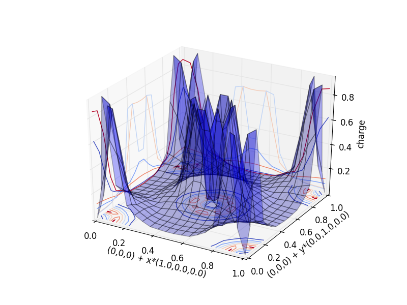
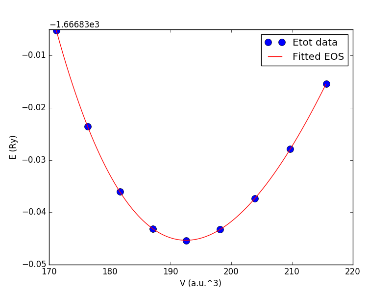

.. _tutorial:

*********
Tutorial
*********

This is a simple tutorial demonstrating the main functionalities of :py:mod:`postqe`. The examples below show how to use the package to perform the most common tasks. The code examples can be found in the directory *examples* of the package and can be run either as interactive sessions in your Python intepreter or as scripts.
The tutorial is based on the following examples:

+---------------+------------------------------------------------------------------------------------------------------------------------------------------+
| Example n.    | Description                                                                                                                              |
+===============+==========================================================================================================================================+
| 1             | Plotting a 1D section of the charge density                                                                                              |
+---------------+------------------------------------------------------------------------------------------------------------------------------------------+
| 2             | Plotting a 2D section of the charge density                                                                                              |
+---------------+------------------------------------------------------------------------------------------------------------------------------------------+
| 3             | Fitting :math:`E_{tot}(V)` for a cubic (isotropic) system using Murnaghan EOS                                                            |
+---------------+------------------------------------------------------------------------------------------------------------------------------------------+

Several simplified plotting functions are available in :py:mod:`postqe` and are used in the following tutorial to show what you can plot.
Note however that all plotting functions need the matplotlib library, which must be available on your system and can be used to further taylor your plot. 

===========================================================
Plotting a 1D section of the charge density  (examples 1)
===========================================================

The most common task you can do with :py:mod:`postqe` is probably to plot the electronic charge density along one direction. The charge is read from the HSF5 
output file create by the Quantum Espresso calculation in *outdir*. 
The code to do this is shown below:

.. literalinclude:: ../examples/example1/example1.py
   :language: python
   :dedent: 4
   :lines: 10-
 
and it is essentially a call to the function :py:func:`plot_charge1D`, which needs in input the xml file create by Quantum Espresso. 
All other values are optional and taken either from the xml file or from 
 default values. By default, the charge is plotted from the point (0,0,0) along the direction (1,0,0).

===========================================================
Plotting a 2D section of the charge density  (examples 2)
===========================================================

This example is similar to the previous one except for producing a 2D plot of a planar section of the electronic charge density. The plane is defined 
by an initial point and two 3D vectors which define the plane. 

.. literalinclude:: ../examples/example2/example2.py
   :language: python
   :dedent: 4
   :lines: 10-
   
As in the previous example, it is essentially a call to a single function, which is in this case :py:func:`plot_charge1D`.
The output figure is:

===========================================================
Fitting the total energy using Murnaghan EOS (examples 3)
===========================================================

The simplest task you can do with :py:mod:`postqe` is to fit the total energy as a function of volume :math:`E_{tot}(V)` (example3). You can use
an equation of state (EOS) such as Murnaghan's or similar.  Currently the Murnaghan EOS and quadratic and quartic polynomials are implemented in :py:mod:`postqe`. 

Let's see how to fit :math:`E_{tot}(V)`. This is the case of isotropic cubic systems (simple cubic, body centered cubic, face centered cubic) or systems which can be approximated as isotropic (for example an hexagonal system with nearly constant :math:`c/a` ratio).

.. literalinclude:: ../examples/example3/example3.py
   :language: python
   :dedent: 4
   :lines: 10-
   
The :py:func:`fitEtotV` needs in input a file with two columns: the first with the volumes (in :math:`a.u.^3`), the second with energies (in :math:`Ryd/cell`). It returns the volumes *V* and energies *E* from the input file plus the fitting coefficients *a* and the :math:`\chi^2` *chi*. The fitting results are also written in details on the *stdout*:

.. literalinclude:: ../examples/example3/out

Optionally, you can plot the results with the :py:func:`plot_EV`. The original data are represented as points. If *a!=None*, a line with the fitting EOS will also be plotted. The output plot looks like the following:

