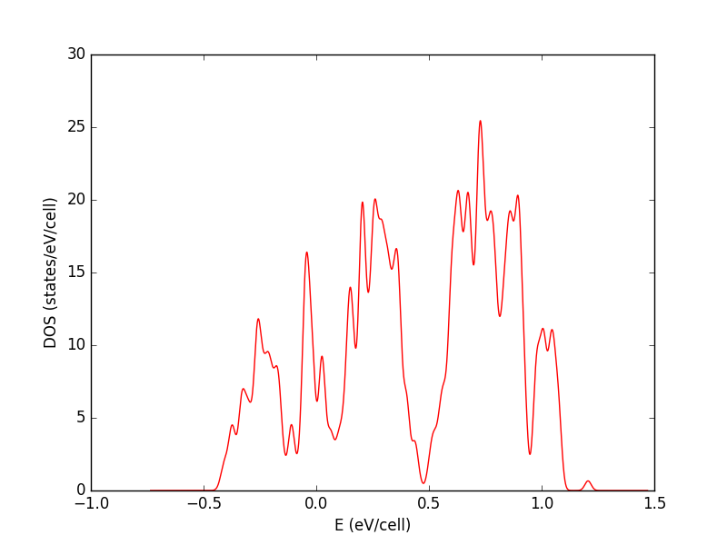
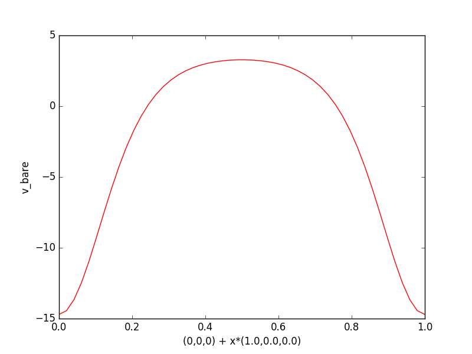
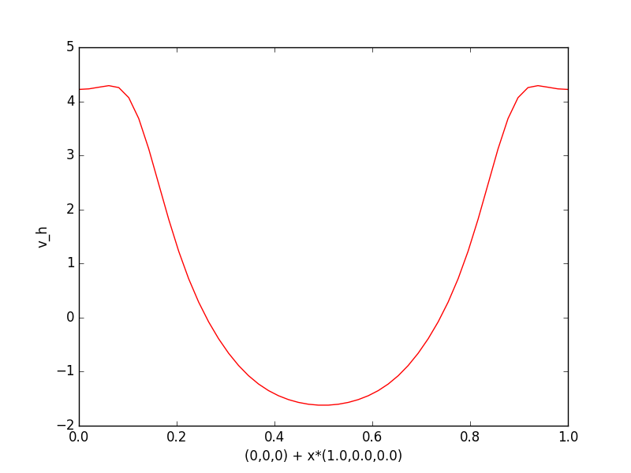
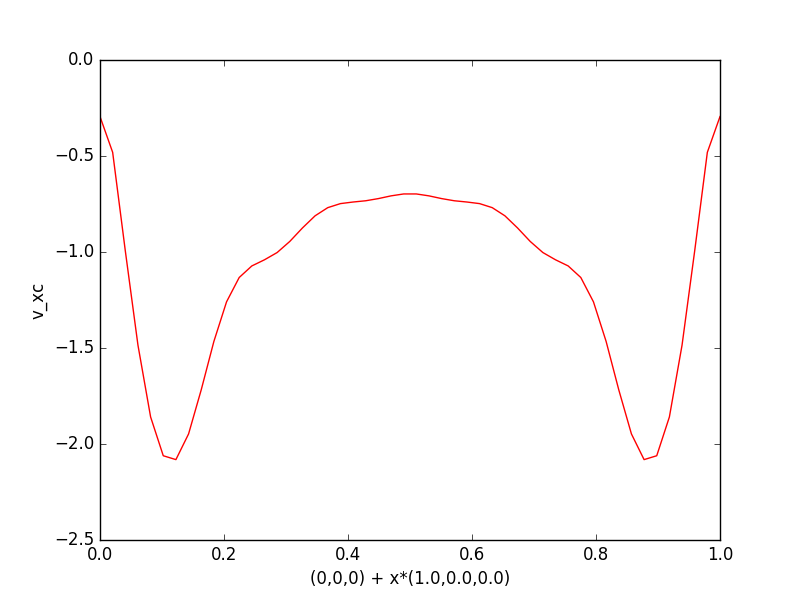
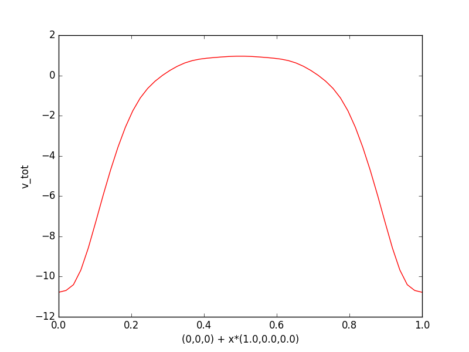

.. _tutorial:

*********
Tutorial
*********

This is a simple tutorial demonstrating the main functionalities of :py:mod:`postqe`. The examples below show how to use the package to perform the most common tasks. The code examples can be found in the directory *examples* of the package and can be run either as interactive sessions in your Python interpreter or as scripts.
The tutorial is based on the following examples:

+---------------+------------------------------------------------------------------------------------------------------------------------------------------+
| Example n.    | Description                                                                                                                              |
+===============+==========================================================================================================================================+
| 1             | Fitting :math:`E_{tot}(V)` for a cubic (isotropic) system using Murnaghan EOS                                                            |
+---------------+------------------------------------------------------------------------------------------------------------------------------------------+
| 2             | Calculate and plot the band structure of silicon                                                                                         |
+---------------+------------------------------------------------------------------------------------------------------------------------------------------+
| 3             | Calculate and plot the density of states (DOS) of silicon 						                           |
+---------------+------------------------------------------------------------------------------------------------------------------------------------------+
| 4             | Plotting a 1D section of the charge density                                                                                              |
+---------------+------------------------------------------------------------------------------------------------------------------------------------------+
| 5             | Plotting a 2D section of the charge density                                                                                              |
+---------------+------------------------------------------------------------------------------------------------------------------------------------------+
| 6             | Plotting 1D sections of different potentials                                                                                             |
+---------------+------------------------------------------------------------------------------------------------------------------------------------------+

Several simplified plotting functions are available in :py:mod:`postqe` and are used in the following tutorial to show what you can plot.
Note however that all plotting functions need the matplotlib library, which must be available on your system and can be used to further tailor your plot. 

===========================================================
Fitting the total energy using Murnaghan EOS (examples 1)
===========================================================

The simplest task you can do with :py:mod:`postqe` is to fit the total energy as a function of volume :math:`E_{tot}(V)`. You can use
an equation of state (EOS) such as Murnaghan's or similar.  Currently you can use Murnaghan, Vinet, Birch, Birch-Murnaghan, Pourier-Tarantola and Anton-schmidt EOS and 3rd order (direct and inverse) polynomials in :py:mod:`postqe`. See the documentation of :py:func:`get_eos` for details.

Let's see how to fit :math:`E_{tot}(V)`. This is the case of isotropic cubic systems (simple cubic, body centered cubic, face centered cubic) or systems which can be approximated as isotropic (for example an hexagonal system with nearly constant :math:`c/a` ratio).

.. literalinclude:: ../examples/example1/example1.py
   :language: python
   :dedent: 4
   :lines: 10-
   
The :py:func:`get_eos()` needs in input a file with two columns: the first with the volumes (in :math:`a.u.^3`), the second with energies (in :math:`Ryd/cell`). You also define here what EOS to use, in this case Murnaghan's. This function returns an *eos* object. The method :py:func:`fit()` performs the fitting and returns the equilibrium volume *v0*, energy *e0* and bulk modulus *B*. The fitting results can then be printed or further processed.

Optionally, you can plot the results with the :py:func:`plot_EV`. The original data are represented as points. 

.. image:: ../examples/example1/Ni-eos.png
   :width: 500

====================================================================================================================
Calculate and plot the band structure of silicon (examples 2)
====================================================================================================================

This example shows how to calculate the electronic band structure of silicon with :py:mod:`postqe`. All necessary information is extracted from the standard xml output file of Quantum Espresso, produced by a proper calculation along the wanted path in the Brillouin zone. 

.. literalinclude:: ../examples/example2/example2.py
   :language: python
   :dedent: 4
   :lines: 10-

The :py:func:`get_band_structure` needs a parameter *label* which identies the system and the corresponding xml file (label.xml). *label* may contain the full path to the file. The *schema* (optional) parameter allows the code to properly parse and validate the xml file. The parameter *reference_energy* (usually the Fermi level) allows you to shift the plot accordingly. :py:func:`get_band_structure` returns a band structure object which can be further processed.
For example, the method :py:func:`plot` creates a figure and save it in a png file.

.. image:: ../examples/example2/Sibands.png
   :width: 500

==============================================================================================================================
Calculate and plot the density of states (DOS) of silicon (examples 3)
==============================================================================================================================

This example shows how to calculate the electronic density of states (DOS) with :py:mod:`postqe`. All necessary information is extracted from the standard xml output file. The following code shows how to do it for silicon (xml output file: Si.xml)

.. literalinclude:: ../examples/example3/example3.py
   :language: python
   :dedent: 4
   :lines: 11-
   
The :py:func:`get_dos` needs in input the xml file produced by pw.x, after a proper DOS calculation. This is identified using *label* which may contain the full path to the file (.xml is automatically added). The *schema* (optional) parameter allows the code to properly parse and validate the xml file.  You must also specify the number of energy steps in the DOS (*npts*), plus the Gaussian broadening (*width*). :py:func:`get_dos` then returns a DOS object. 

The DOS values and the corresponding energies can be obtained from the DOS object using the methods :py:func:`get_dos` and :py:func:`get_energies`. If you want you can further manipulate these values. For example you can make a plot with the Python library *Matplotlib*. The output plot looks like the following:

.. image:: ../examples/example3/figure.png
   :width: 500

You can of course continue to calculate other quantities in your script. 

===========================================================
Plotting a 1D section of the charge density  (examples 4)
===========================================================

A common task you can do with :py:mod:`postqe` is to plot the electronic charge density along one direction. The charge is read from the HDF5 
output file create by the Quantum Espresso calculation in *outdir*. Additional information are extracted from the standard xml output file, identified by the 'label' parameter in the :py:func:`get_charge` function. The *schema* (optional) parameter allows the code to properly parse and validate the xml file. The full code to do this is shown below:

.. literalinclude:: ../examples/example4/example4.py
   :language: python
   :dedent: 4
   :lines: 10-
 
The call to :py:func:`get_charge` creates a *charge* object. The charge can be written in a text file using the method :py:func:`write`. The call to the method :py:func:`plot` returns a *Matplotlib* figure object containing a 1D section plot of the charge from the point *x0* along the direction *e1*. 
By default, the charge is plotted from the point (0,0,0) along the direction (1,0,0). The *Matplotlib* figure object can be further modified with the standard methods of this library. For example, the plot can be save in a png file using the method :py:func:`savefig`. The result is shown below.

===========================================================
Plotting a 2D section of the charge density  (examples 5)
===========================================================

This example is similar to the previous one except for producing a 2D plot of a planar section of the electronic charge density. The plane is defined 
by an initial point *x0* and two vectors, *e1* and *e2* which define the plane, which are given as parameters to the method :py:func:`plot` together with *dim=2* to define a 2D plot. 

.. literalinclude:: ../examples/example5/example5.py
   :language: python
   :dedent: 4
   :lines: 10-
   
The resulting *Matplotlib* plot is

.. image:: ../examples/example5/figure_1.png
   :width: 500

===========================================================
Plotting 1D sections of different potentials  (examples 6)
===========================================================

This example computes all the different potentials available, i.e. the bare potential :math:`V_{bare}`, the Hartree potential :math:`V_{H}`, the exchange-correlation potential :math:`V_{xc}` and the total potential :math:`V_{tot}=V_{bare}+V_{H}+V_{xc}`. All necessary information is taken from the xml output file of QE and the HDF5 charge file. The pseudopotential file is also necessary to compute :math:`V_{bare}`.

.. literalinclude:: ../examples/example6/example6.py
   :language: python
   :dedent: 4
   :lines: 10-
   
The code essentialy call the function :py:func:`get_potential`, which returns a potential object of the type defined in *pot_typ*. The :py:func:`write` and :py:func:`plot` methods are then used to write the output in a text file and produce the plots as in the previous example (in fact they accept the same parameters). 

The output figures are as follows:

